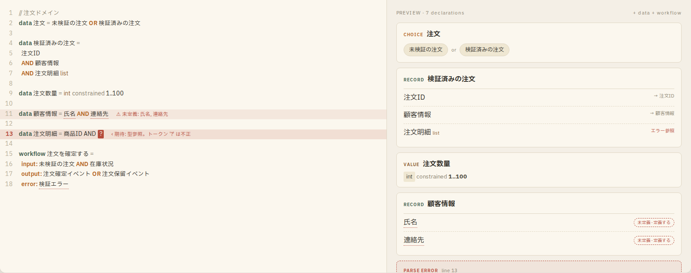
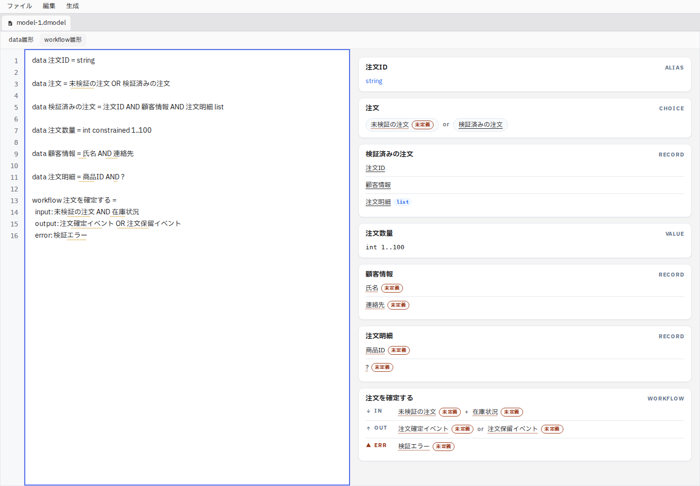
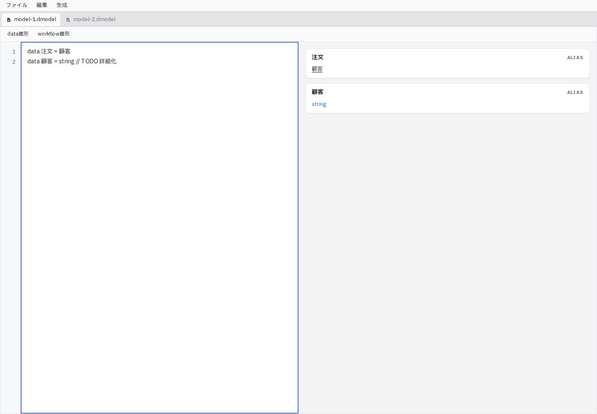
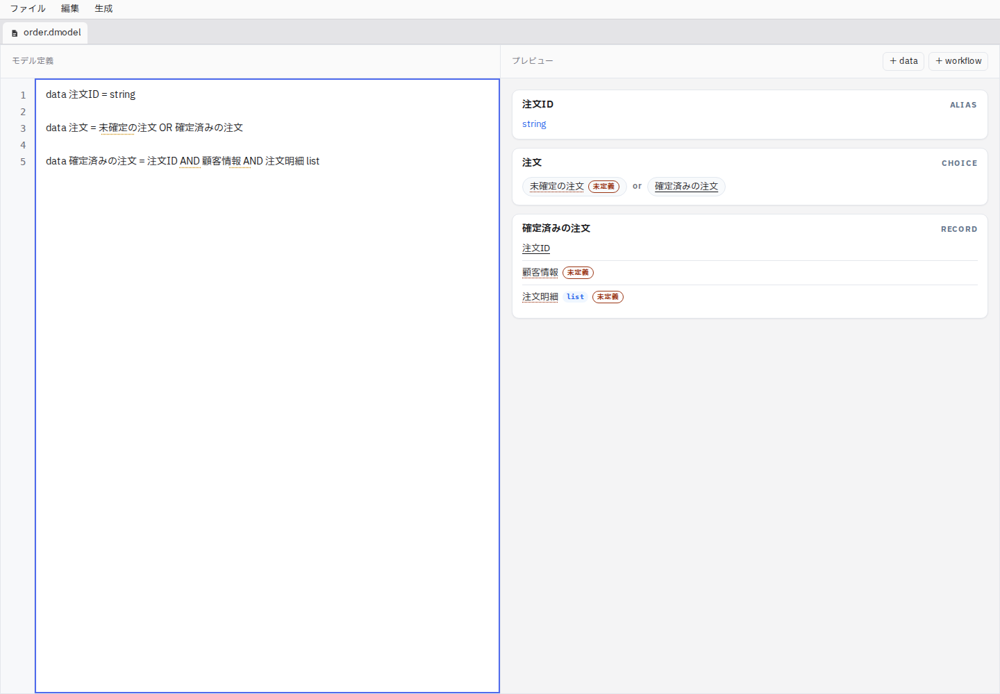

# Issue #224: データ定義の右側プレビュー

## 比較元と原因

比較元: `docs/domain-modeler.html` の埋め込み `__bundler/template` 内、`<!-- Right: preview cards -->`（PREVIEW · 7 declarations）。

本番の `appShell/document-workspace.tsx` はテキスト入力だけの `ModelEditor` を使用していた。左右分割の `ModelDiagnostics` はStorybookとテストに存在したが、本番に未接続だった。プレビュー廃止の仕様変更の根拠は確認できなかった。

| 観点 | HTML | 修正前 | 修正後 |
| --- | --- | --- | --- |
| 編集領域 | 左テキスト・右カード | テキストのみ | 左右分割 |
| データ構造 | CHOICE / RECORD / VALUE | なし | ALIASを含む既存カードを表示 |
| ワークフロー | IN / OUT / ERR | なし | 既存カードを表示 |
| 未定義参照 | バッジ・定義操作 | カードなし | バッジからスタブ挿入 |
| 更新 | 静的表示例 | なし | 編集と文書切り替えに追従 |

現在のテーマ対応済みコンポーネントを維持した。HTMLの右側は44%、現在は50%。種別ラベルはHTMLでは名前の左、現在は右。HTMLの宣言数ヘッダーはなく、雛形操作は当初上部ツールバーに配置し、後述のA案で右側ヘッダーへ移動した。今回は欠けていた表示の接続を修正し、外観の完全一致は行っていない。

HTMLで構文エラー例に使われる `?` は現パーサーでは型名として扱われるため、比較画像では未定義参照になる。既存文法との差分として記録し、この修正では文法を変更しない。

## 表示確認

本番AppをViteで起動し、OSファイルダイアログ・書き込み・監視のIPCのみ代替。Chromium、1440×1000。日本語フォントの無い実行環境のため、比較元の埋め込みフォントを確認時のみ適用した。

指定のplaywright-cliはUnixソケット作成のEPERMで起動できず、Playwright APIで代替した。取得コマンドは `node /tmp/issue224-check.cjs`。内部で `page.screenshot({path: ...})` と比較元の該当領域への `locator.screenshot({path: ...})` を実行した。

定義の入力・置換、旧カードの消去、別モデル文書への切り替えと復帰、未定義バッジからの宣言追加を実操作で確認。重なり・横方向のはみ出しなし。プレビューは独立したスクロール領域。比較元画像はHTMLの該当領域で、元の高さ制限によるスクロールを維持している。OS固有のファイル操作自体はブラウザー確認対象外。

### HTMLデザイン

### 接続後の本番画面

### 文書切り替え後、未定義の顧客を追加

## 検証

- `vitest run src/appShell/__tests__ src/features/model`: 40ファイル・220テスト成功。
- `tsc -b --force`: 成功。
- `oxlint`: 警告・エラー0件。
- App統合テストにカード表示と定義変更後の追従を追加。入力専用コンポーネントへの退行を検出する。

## A案の配置へ更新（2026-09-20）

「＋ data」「＋ workflow」を右側プレビューのヘッダーへ移動。左には「モデル定義」を表示し、左右の見出しを同じ高さに揃えた。ヘッダーはカードのスクロール領域から分離し、長い文書でも追加操作を利用できる。

`node /tmp/224-a-check.cjs` で1440×1000と1280×720の配置、両ボタンからの挿入、挿入後の名前選択、30定義のスクロール後もヘッダーが同じ位置に残ることを確認。取得画像を目視し、重なり・はみ出しが無いことを確認した。Playwright APIを使用（前述のCLIソケット制約と同じ環境）。関連19テスト・型チェック・Lint成功。

